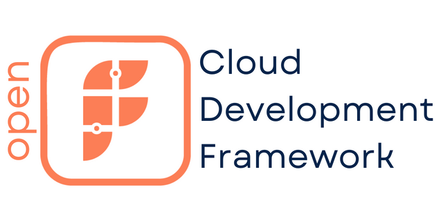

# OpenFABR Cloud Development Framework (CDF) 

**OpenFABR CDF: The IaC framework to build cloud infrastructure faster**

*developed and sponsored by [FABR](https://fabrhq.com)*

Framework:
- TypeScript: 

Packages as reference implementations:
- TypeScript, AWS CDK: 
- TypeScript, Terraform CDK: 

Sample projects using the packages above:
  - [TypeScript, AWS CDK](./samples/projects/awscdk-typescript/README.md) for [AWS](https://aws.amazon.com)
  - [TypeScript, Terraform CDK](./samples/projects/cdktf-typescript/README.md) for [Digital Ocean](https://digitalocean.com)

## [Documentation](https://openfabr.github.io/cdf/)

## Introduction

OpenFABR CDF aims to offer a brand new way of building cloud infrastructure, based on our view that the future of DevOps is **MODULAR + CUSTOM**.

We envisage a future where application developers (in product engineering) and DevOps engineers (in platform engineering) collaborate by code in a true Infrastructure-as-Code manner. There are various IaC runtime, imperative language supports and existing software delivery infrastructure such as code and artefact repositories. OpenFABR CDF is the missing piece that makes it happen. 

### MODULAR: Reusable, High-level Packages

Ad-hoc, bespoke infra build project after project should be a thing of past. There are common patterns emerging that can be encapsulated into reusable modules, or L2/L3 constructs as AWS would call them. Bigger engineering organisations with platform engineering function also tend to have their own opinions about how their internal cloud operations can be constructed by high-level components, which in turn can be offered to the product engineering counterpart in the same organisation.  

### CUSTOM: Project-specific Code Blocks

Abstraction (via packages mentioned above) is hard, and almost impossible to work without an escape hatch, because every infra project could have its own quirks, e.g. special permissions, external dependencies, or even different domain names. OpenFABR CDF fully acknowledges it by offering an inversion-of-control based custom code block feature for application developers to access all underlying cloud resources fully, for customisation.  

### The Framework

For application developers, OpenFABR CDF is the framework that pieces together a cloud infra package with local custom code to deliver a cloud infra project extremely quickly. 

- From 0 to 95%: With the help of a selected package, an infra baseline can be assembled using a simple, schema-aware JSON configuration file. This can be done in *minutes* or *hours*, instead of days or weeks.
- From 95% to 100%: Every project is different, the framework allows detailed customisation to every underlying infra resources being created by the modular approach earlier. This can be done in *hours* or *days*, certainly not *weeks*.

For DevOps/Cloud/Platform engineers, adopting OpenFABR CDF means following a separation-of-concern approach by implementing modular, reusable packages from day one. 

Best of all, OpenFABR CDF does not have any opinions about what IaC runtime (AWS CDK and Terraform CDK; Pulumi and others coming soon) and language (Typescript; Python, Java, C# and Golang coming soon) one should use. It allows engineering organisations to pick their favourite runtime and language. It forms the foundation of an internal cloud platform and leaves the opinions about how to implement cloud infrastructure to package authors and application developers.

## Use

Follow the [Getting Started](./docs/get-started/quick-start.md) to experience the workflow yourself.

To dive deep, the [User Guide](./docs/user-guide/overview.md) covers the context as well as detailed manuals for both application developers and package authors.

We are on hand to support you:

- [Discord](https://discord.com/channels/1039810916625162260/1039819988296552510)

## Contribute

### License and Contribution Agreement

Same as other OpenFABR projects, it is dual-licensed under

- [GNU AGPL v3](https://www.gnu.org/licenses/agpl-3.0.en.html)
- [FABR Commercial v1](#) (coming Soon)

Before accepting your contribution, please e-sign the [Contributor License Agreement](#) (coming soon) which is a common practice in open source. Once signed, your GitHub username will then be registered on the project's contributor list which safeguards the contributions to the project.

### Development

The monorepo is structured in a way that different build tools are used for different CDF language implementation. See below for details about how to develop for CDF in a particular language:

- Framework:
  - [core/typescript](./core/typescript/README.md) for CDF
- Packages as reference implementations:
  - [samples/packages/awscdk-typescript](./samples/packages/awscdk-typescript/README.md) for TypeScript based AWS CDK package
  - [samples/packages/cdktf-typescript](./samples/packages/cdktf-typescript/README.md) for TypeScript based CDKTF package
- Sample projects based on the use of the packages above:
  - [samples/projects/awscdk-typescript](./samples/projects/awscdk-typescript/README.md) for using the TypeScript AWS CDK package above
  - [samples/projects/cdktf-typescript](./samples/projects/cdktf-typescript/README.md) for using the TypeScript CDKTF package above
- Documentation:
  - [Quick Start](./docs/get-started/)
  - [User Guide](./docs/user-guide/)

Tools and libraries in use include:

- [GitHub Actions](https://docs.github.com/en/actions) are used as CI/CD tooling. Again the build and release workflows vary between sub repos based on language, framework etc.

- [Conventional Commits](https://www.conventionalcommits.org/) spec is strictly followed which enabled the use of [Release Please](https://github.com/googleapis/release-please) across CDF releases in different languages.

- [Material for MkDocs](https://squidfunk.github.io/mkdocs-material/) is used to generate the doc site from [markdown format](https://www.markdownguide.org/basic-syntax/). A Github Actions workflow handles CI/CD. It can also be [previewed locally](./preview-docs.sh) before creating pull requests.
