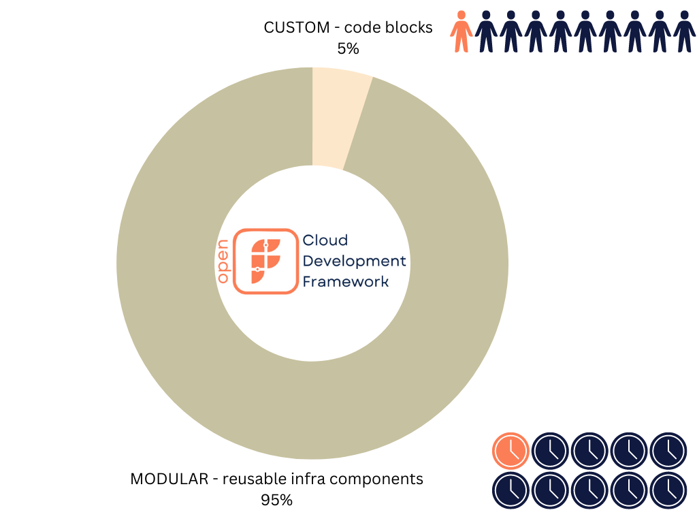

# What is CDF

OpenFABR CDF aims to offer a brand new way of building cloud infrastructure, based on our view that the future of DevOps is **MODULAR + CUSTOM**.

We envisage a future where application developers (in product engineering) and DevOps/Cloud engineers (in platform engineering) collaborate by code in a true Infrastructure-as-Code manner. OpenFABR CDF is the missing piece, the glue, that brings the entire tool chain together from IaC runtimes like CDK, to imperative languages like TypeScript, testing frameworks like Jest, and artefact repositories like NPM.

## MODULAR: Reusable, High-level Packages

Ad-hoc, bespoke infra build project after project should be a thing of past. There are common patterns emerging that can be encapsulated into reusable modules, or L2/L3 constructs as AWS would call them. Bigger engineering organisations with platform engineering function also tend to have their own opinions about how their internal cloud operations can be constructed by high-level components, which in turn can be offered to the product engineering counterpart in the same organisation.  

Read more [here](./why-modular.md).

## CUSTOM: Project-specific Code Blocks

Abstraction (via packages mentioned above) is hard, and almost impossible to work without an escape hatch, because every infra project could have its own quirks, e.g. special permissions, external dependencies, or even different domain names. OpenFABR CDF fully acknowledges it by offering an inversion-of-control based custom code block feature for application developers to access all underlying cloud resources fully, for customisation.  

Read more [here](./why-custom.md).

## The Framework

For application developers, OpenFABR CDF is the framework that pieces together a cloud infra package with local custom code to deliver a cloud infra project extremely quickly. 

- From 0 to 95%: With the help of a selected package, an infra baseline can be assembled using a simple, schema-aware JSON configuration file. This can be done in *minutes* or *hours*, instead of days or weeks.
- From 95% to 100%: Every project is different, the framework allows detailed customisation to every underlying infra resources being created by the modular approach earlier. This can be done in *hours* or *days*, certainly not *weeks*.

For DevOps/Cloud/Platform engineers, adopting OpenFABR CDF means following a separation-of-concern approach by implementing modular, reusable packages from day one. It enables producing a clean contract with product engineers precisely defining what infrastructure is available and how to use it. 

Best of all, OpenFABR CDF does not have any opinions about what IaC runtime (AWS CDK, CDK Terraform, and Pulumi) and language (Typescript; Python, Java, C# and Golang coming soon) one should use. It allows engineering organisations to pick what aligns with their stack and skills. It forms the foundation of an internal cloud platform and leaves the opinions about how to implement cloud infrastructure to package authors and application developers.
