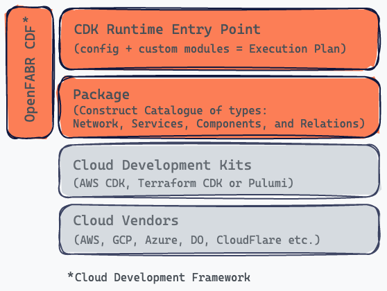

# Framework Implementation

This is a concrete implementation of the `Framework Spec`.

## Framework Schema

A JSON schema that concretely captures the above Framework spec.

## Construct Type

Concrete type implementations for each of the Construct Types defined in the spec above.

## Construct

Concrete implementation of a cloud infra abstraction, of a `Construct Type`, using a chosen IaC Runtime such as AWS CDK, TF CDK or Pulumi. **Typically abstractions over one or more Cloud Vendor services, this is the key point of the framework**. However, nothing is preventing a `Package Author` from exposing Cloud Vendor service constructs as is if needed. The configuration binding logic is also part of the construct implementation.

## Construct Instance

An instance of a `Construct` with a particular configuration supplied by the application developer. The concept is the same as a class and instance of a class in OOP. This is one-to-one with a piece of deployed infrastructure.

## InfraPlan

Implementation of the base structure of the in-memory representation of an infra design/plan. It’s exposed by the package and generated at runtime based on the `config.json` supplied. This essentially describes the infrastructure that will be deployed by the IaC Runtime.

## Planner

Implementation of the base factory used to create instances of `InfraPlan` based on the application dev supplied `Config` (`config.json`).

## Execution Plan

This is the general term used in OpenFABR CDF to refer to the final plan or infra configuration that will be deployed by the respective IaC Runtime. Each IaC Runtime has its own structure and name for its representation of this. For example, `Stack` in AWS CDK and `TerraformStack` in TF CDK.

## Config

A JSON formatted file containing the runtime supplied config `InfraPlan`. Conforming to the schema defined in config.def.json.

## Orchestrator

Combines the `InfraPlan` exposed by the `Package` with any `Custom` modules to produce an `Execution Plan`. This is called from the IaC Runtime entry point.
