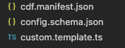

# Framework Spec

OpenFABR CDF defines a configuration language for package authors to describe how they define reusable cloud infrastructure, in the form of package metadata which consist of a number of files. 

It is worth pointing that the package metadata files are mandatory when a package is integrated into a GUI-based tool such as [FABR Infra](https://fabrhq.com) because those software tooling can only rely on machine readable information to assist project creators to build cloud infrastructure using a specific package. It is however optional, though highly recommended when using a package directly with CDF, as long as the same information is documented by package authors. it is therefore package authors' responsibility to maintain up-to-date documentations for packages they develop. 

## Types and Constraints

OpenFABR CDF as a specification needs types and constraints to set up the foundation for the value system, just like other programming languages such as SQL. 

### Types

`PLAIN_TEXT`
: a plain text string value, UTF-8 encoded, usually less than 2,000 characters in length

`NUMBER`
: a numerical value

`BOOLEAN`
: a boolean (true/false) value

`TEXT_LIST`
: a list of `SIMPLE_TEXT` values, UTF-8 encoded, usually less than 100 entries

`NUM_LIST`
: a list of `NUMBER` values

`URL`
: a valid URL type string value, UTF-8 encoded, under 2048 characters long

`SIMPLE_TEXT`
: a URL-friendly string value, usually less than 100 characters in length and commonly used in forming domain names and/or URLs, UTF-8 encoded

`MARKDOWN_TEXT`
: a Markdown-formatted string value, usually for descriptive purposes, UTF-8 encoded, [CommonMark spec](https://github.com/commonmark/commonmark-spec), less than 2,000 characters in length
IP_ADDRESS: in either IPv4 or IPv6 format

### Constraints

`REQUIRED`
: can apply to all types

`UNIQUE`
: value must be unique among the same type of `Construct` in a `Stack`, also implying REQUIRED

`IN_LIST(TEXT_LIST)`
: for `TEXT` type

`IN_LIST(NUMBER_LIST)`
: for `NUMBER` type

`MIN_LENGTH(NUMBER)`
: for `TEXT` and `SLUG` types

`MAX_LENGTH(NUMBER)`
: for `TEXT` and `SLUG` types

`DEPENDENT_ON(MAP<TEXT, Any>)`
: for all types

## Construct Types

`Constructs` (see definitions below) are the building blocks of an infrastructure architecture (defined as an `InfraPlan` below). Each construct must be one of the following types:

`General`
: not directly infrastructure related, it defines necessary metadata about the package itself. 

`Network`
: the foundational network environment an application runs in. e.g. AWS VPC

`Service`
: a deployable target where your application code runs, typically containerised app runtime and ephemeral. A `Service` can communicate with other `Service` instances and `Components`. Services can be internal/private or public Internet facing. They can be hooked up to CI/CD pipelines so that application code release can be automated, such as a NodeJS REST API on an AWS ECS Fargate service.

`Component`
: third-party infrastructure services that your application depends on. They are typically private/internal and persistent. They could be self-hosted by you or managed services by a cloud provider e.g. AWS Aurora Database, AWS SQS, or AWS Elasticache for Redis

`Relations`
: indicates a directional link between a service or component and another service or component, for a specific purpose. E.g. NodeJS API communicating with an Aurora Database instance.

`Custom`
: where local customisation is packaged, which is almost always needed to complement the use of the other building blocks from a given implementation package. 

`Aspect`
: another way to apply local customisation, albeit targeting a specific resource provisioned in the underlying cloud vendor.

Below are the **framework-defined** attributes for each construct. 

**More can be defined by package authors per package** and package authors are encouraged to do so to expose configurable options for project creators to fine-tune underlying infrastructure. 
## General

Name: SIMPLE_TEXT

*See `GeneralConfig` interface defined in CDF*

## Network

Name: SIMPLE_TEXT

Cidr: complex type [subnet: IP_ADDRESS, mask: NUMBER]

*See `NetworkConfig` interface defined in CDF*

## Component (and Trait)

Name: SIMPLE_TEXT

UsageType: SIMPLE_TEXT | IN_LIST (all supported component types such as storage, messaging, and streaming)

Type: SIMPLE_TEXT

Subtype: SIMPLE_TEXT

*See `TraitConfig` and `ComponentConfig` interfaces defined in CDF*

## Service (and Runtime)

Name: SIMPLE_TEXT

PackageType: SIMPLE_TEXT | IN_LIST (‘container’, ‘application’)

Type: SIMPLE_TEXT

Subtype: SIMPLE_TEXT

*See `RuntimeConfig` and `ServiceConfig` interfaces defined in CDF*

## Relation

Start: SIMPLE_TEXT | IN_LIST (all Service & Component names defined in the same Plan)

Finish: SIMPLE_TEXT | IN_LIST (all Service & Component names defined in the same Plan)

Bidirectional: BOOLEAN

*See `RelationConfig` interface defined in CDF*

## Custom

This is a unique building block.

It is meant to be implemented locally, specific to the belonging Plan;

It has several inputs defined by the implementation package, usually an aggregation of all the underlying cloud services managed by those building blocks;

With those inputs, further customisations are expected to be packaged in a Custom module;

There can be as many Custom modules as needed.

*See `Custom` abstract class defined in CDF*

## Aspect

TBD

## Package Metadata

The package metadata consist a pack of files covering all that has been mentioned above. It’s intended to be used by software tooling to understand the abstraction that a package makes available for project creators to use. The primary goal is making it a machine readable protocol so that software tooling can be developed to further aid project creators when using a selected package. 

An example of the files is shown below,



Those files are described individually below.

### Package Manifest

It is aptly named `cdf.manifest.json` inside a package at root level, which contains attributes listed below to describe the package and links to other metadata files. It is the top-level plan when defining a package for consumption. 

An example (as defined in `PackageManifest` interface defined in CDF) is shown below,

```typescript
/**
 * Interface for modelling a package manifest json file that provides information about the package.
 * Crucially it also carries two references respectively to a) a json schema file for validating json config files and b) a template file for custom code blocks.
 *
 * @group For both project creators and package authors
 */
export interface PackageManifest extends OptionalIconAware {
  /**
   * The descriptive name of the package.
   */
  name?: string;
  /**
   * The unique identifier of the package.
   */
  identifier: string;
  /**
   * The author of the package.
   */
  vendor: string;
  /**
   * The SPDX license identifier for the license that the package is released under.
   *
   * @see https://spdx.org/licenses/
   */
  license: string;
  /**
   * The description of the package.
   */
  description?: string;
  /**
   * Information about the support provided for the package.
   */
  support?: SupportInfo;
  /**
   * The version of OpenFABR CDF that this package is compatible with, following semantic versioning.
   */
  cdf: string;
  /**
   * Information about tooling the package relies on.
   */
  tooling: ToolingInfo;
  /**
   * Information about constructs defined in the package.
   */
  constructs: ConstructsInfo;
}
```

*The exact file name `cdf.manifest.json` has to be used in order to be located by any software tooling.*


### Config Definition via JSON Schema

It is a JSON schema file, usually generated with the help of `cdf-cli` tool from reading the TypeScript based package configurations. It is not expected to be manually edited afterwards. Whenever there is a change to the package configurations, the schema file should be re-generated.

*The name of the config definition can be arbitrary as long as it is referenced correctly by the package manifest, i.e. `cdf.manifest.json`.*

### Template for Custom Code Block

It is IaC runtime and language specific, i.e. if the package is created for Terraform CDF TypeScript, then the template is expected to be in TypeScript. Below is an example,

```typescript
import { err, Result } from "neverthrow";
import * as cdf from "@openfabr/cdf";
import { PackageCustomModule, PackageInfraConfig, PackageInfraPlanConstructs } from "./package-config";

export class ProjectCustomModule implements PackageCustomModule {

  enhanceWith(config: PackageInfraConfig, result: cdf.InfraPlan<PackageInfraPlanConstructs>, scope: any): Result<cdf.InfraPlanOutputs, cdf.PlanError> {
    // Write your customisation here and remove the line below.
    return err({ message: "Method not implemented." });
  }
  
}
```

*The name of the template can be arbitrary as long as it is referenced correctly by the `Package Manifest` file.*
